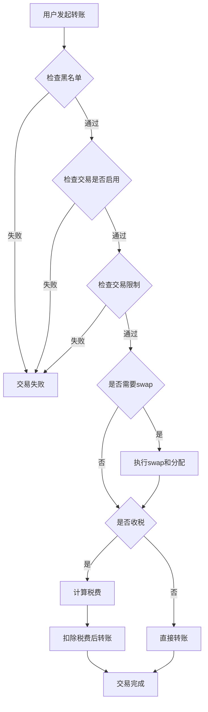

# SHIB风格Meme代币合约

一个功能完整的SHIB风格Meme代币智能合约实现，包含代币税机制、自动流动性注入、交易限制和反机器人保护功能。

## 📋 目录

- [项目概述](#项目概述)
- [核心功能](#核心功能)
- [技术架构](#技术架构)
- [快速开始](#快速开始)
- [部署指南](#部署指南)
- [操作手册](#操作手册)
- [测试指南](#测试指南)
- [安全考虑](#安全考虑)
- [常见问题](#常见问题)

---

## 项目概述

ShibaMemeToken是一个基于以太坊ERC20标准的Meme代币合约，采用Hardhat开发框架，集成了现代DeFi代币的核心机制。

### 特性亮点

✅ **代币税机制** - 灵活的买入/卖出税配置  
✅ **自动流动性** - 税费自动添加到Uniswap流动性池  
✅ **交易限制** - 单笔限额、最大持有量、冷却期  
✅ **反机器人** - 启动保护、黑名单、夹子防护  
✅ **安全设计** - OpenZeppelin库、防重入、权限控制  
✅ **完整测试** - 全面的单元测试覆盖  

---

## 核心功能

### 1. 代币税机制

#### 税率配置
- **买入税**：默认 5% (可调整 0-25%)
- **卖出税**：默认 10% (可调整 0-25%)
- **启动保护**：前10个区块 99% 税率防夹子攻击

#### 税费分配
```
默认分配比例：
├── 流动性池：40%
├── 营销钱包：30%
├── 开发钱包：20%
└── 代币销毁：10%
```

#### 自动处理
- 累积税费达到阈值时自动触发
- 自动swap代币为ETH
- 自动添加流动性到Uniswap
- 自动分配ETH给营销和开发钱包

### 2. 流动性池集成

#### Uniswap V2集成
- 自动创建交易对 (Token/ETH)
- 支持自动添加流动性
- LP代币发送给指定钱包
- 防止流动性被套利

#### 流动性保护
- 流动性钱包可配置
- 支持流动性锁定
- 防止Rug Pull机制

### 3. 交易限制策略

#### 三层限制机制

**1. 单笔交易限额**
```solidity
默认：总供应量的 0.5%
可调整范围：最低 0.1%
```

**2. 最大持有量限制**
```solidity
默认：总供应量的 2%
可调整范围：最低 1%
豁免：流动性池、合约、Owner
```

**3. 冷却期机制**
```solidity
默认：60秒
可调整范围：0-300秒
防止高频交易和机器人
```

#### 豁免机制
- Owner自动豁免
- 合约地址豁免
- 流动性池豁免
- 可手动设置豁免地址

### 4. 黑名单功能

- 支持单个地址黑名单
- 支持批量设置黑名单
- 黑名单地址无法转入/转出
- 用于反欺诈和合规要求

### 5. 安全特性

- **防重入攻击**：使用ReentrancyGuard
- **权限控制**：Ownable权限管理
- **安全数学**：Solidity 0.8+ 内置溢出保护
- **标准库**：使用OpenZeppelin审计过的库
- **紧急功能**：资金救援、暂停交易

---

## 技术架构

### 技术栈

| 组件 | 技术选型 | 版本 |
|------|---------|------|
| 智能合约语言 | Solidity | 0.8.20 |
| 开发框架 | Hardhat | 2.19+ |
| 测试框架 | Chai + Ethers.js | 最新 |
| 标准库 | OpenZeppelin | 5.0.0 |
| DEX集成 | Uniswap V2 | - |

### 合约架构

```
ShibaMemeToken
├── ERC20 (OpenZeppelin)
│   ├── 基础代币功能
│   └── _update() 重写
├── Ownable (OpenZeppelin)
│   └── 权限管理
├── ReentrancyGuard (OpenZeppelin)
│   └── 防重入保护
└── IShibaMeme (自定义接口)
    ├── 税费管理
    ├── 限制管理
    └── 黑名单管理
```

### 核心逻辑流程

#### 转账流程


---

## 快速开始

### 前置要求

- Node.js >= 16.0.0
- npm 或 yarn
- MetaMask 或其他以太坊钱包
- 测试网ETH (Sepolia)

### 安装依赖

```bash
# 进入项目目录
cd meme_token

# 安装依赖
npm install

# 或使用 yarn
yarn install
```

### 编译合约

```bash
npx hardhat compile
```

### 运行测试

```bash
# 运行所有测试
npx hardhat test

# 运行特定测试
npx hardhat test test/ShibaMemeToken.test.js

# 查看测试覆盖率
npx hardhat coverage

# 显示Gas报告
REPORT_GAS=true npx hardhat test
```

---

## 部署指南

### 1. 配置环境变量

复制环境变量模板：
```bash
cp .env.example .env
```

编辑 `.env` 文件：
```env
# Sepolia测试网RPC
SEPOLIA_RPC_URL=https://eth-sepolia.g.alchemy.com/v2/YOUR_API_KEY

# 部署账户私钥
PRIVATE_KEY=your_private_key_here

# Etherscan API Key（用于合约验证）
ETHERSCAN_API_KEY=your_etherscan_api_key

# 可选：营销和开发钱包地址
MARKETING_WALLET=0x...
DEV_WALLET=0x...
```

### 2. 部署到本地测试网

```bash
# 启动本地Hardhat网络
npx hardhat node

# 在新终端部署合约
npx hardhat run scripts/deploy.js --network localhost
```

### 3. 部署到Sepolia测试网

```bash
npx hardhat run scripts/deploy.js --network sepolia
```

### 4. 验证合约

部署成功后，使用Etherscan验证：

```bash
npx hardhat verify --network sepolia <CONTRACT_ADDRESS> \
  "Shiba Meme Token" \
  "SHIBM" \
  "1000000000000000000000000000000" \
  "<ROUTER_ADDRESS>" \
  "<MARKETING_WALLET>" \
  "<DEV_WALLET>"
```

---

## 操作手册

### 部署后的必要步骤

#### ⚠️ 重要：按顺序执行以下步骤

### 第一步：添加流动性

```bash
# 配置代币地址
export TOKEN_ADDRESS=0x...

# 运行添加流动性脚本
npx hardhat run scripts/addLiquidity.js --network sepolia
```

或手动添加：
1. 访问 Uniswap
2. 选择 Add Liquidity
3. 添加 Token/ETH 交易对
4. 建议初始流动性：至少 1 ETH

### 第二步：锁定流动性 🔒

**极其重要！必须锁定LP代币防止Rug Pull！**

推荐平台：
- [Unicrypt](https://www.unicrypt.network/)
- [Team Finance](https://www.team.finance/)
- [PinkSale](https://www.pinksale.finance/)

锁定参数建议：
- 锁定时长：≥ 6个月（推荐1年+）
- 锁定比例：100%
- 解锁方式：线性或阶梯解锁

### 第三步：启用交易

```javascript
// 使用Hardhat控制台
npx hardhat console --network sepolia

// 执行命令
const token = await ethers.getContractAt("ShibaMemeToken", "YOUR_TOKEN_ADDRESS");
await token.enableTrading();
```

### 第四步：配置参数（可选）

根据需要调整以下参数：

#### 调整税率
```javascript
// 买入3%，卖出8%
await token.setTaxRates(300, 800);
```

#### 调整税费分配
```javascript
// 流动性50%，营销30%，开发10%，销毁10%
await token.setTaxDistribution(5000, 3000, 1000, 1000);
```

#### 调整交易限制
```javascript
const totalSupply = await token.totalSupply();
const newMaxTx = totalSupply * 10n / 1000n; // 1%
const newMaxWallet = totalSupply * 30n / 1000n; // 3%
await token.setLimits(newMaxTx, newMaxWallet);
```

#### 调整冷却期
```javascript
// 设置为30秒
await token.setCooldown(30);
```

### 常用管理操作

#### 查询合约状态

```bash
# 使用交互脚本
npx hardhat run scripts/interact.js --network sepolia
```

#### 设置免税地址

```javascript
// CEX钱包、质押合约等
await token.setExcludeFromFees("0x...", true);
```

#### 添加黑名单

```javascript
// 单个地址
await token.setBlacklist("0x...", true);

// 批量添加
await token.setBlacklistBatch(["0x...", "0x...", "0x..."], true);
```

#### 更新税费钱包

```javascript
await token.setTaxWallets(
  "0x...liquidity",
  "0x...marketing",
  "0x...dev"
);
```

#### 手动触发税费分配

```javascript
// 当累积税费未达到阈值但需要立即分配时
await token.manualSwapAndDistribute();
```

#### 禁用交易限制

```javascript
// 通常在项目成熟后执行
await token.setLimitsEnabled(false);
```

#### 紧急救援资金

```javascript
// 救援误转入的ETH
await token.rescueETH();

// 救援误转入的其他代币
await token.rescueTokens("OTHER_TOKEN_ADDRESS");
```

---

## 测试指南

### 测试覆盖范围

本项目包含全面的单元测试，覆盖以下场景：

#### 1. 部署与初始化
- ✅ 代币名称和符号设置
- ✅ 总供应量铸造
- ✅ 初始税率配置
- ✅ 交易限制初始化
- ✅ 豁免地址设置

#### 2. 基础转账功能
- ✅ Owner在交易未启用时可转账
- ✅ 非白名单用户被阻止
- ✅ 启用交易后正常转账

#### 3. 交易限制测试
- ✅ 单笔交易限额强制执行
- ✅ 最大持有量限制
- ✅ 冷却期机制
- ✅ 限制参数调整
- ✅ 禁用限制功能

#### 4. 税费机制测试
- ✅ 税率调整
- ✅ 税率上限保护
- ✅ 税费分配比例设置
- ✅ 税费钱包更新

#### 5. 黑名单测试
- ✅ 添加黑名单
- ✅ 黑名单阻止转账
- ✅ 批量设置黑名单
- ✅ Owner保护

#### 6. 权限控制测试
- ✅ 非Owner无法修改参数
- ✅ 关键函数权限保护

#### 7. 边界条件测试
- ✅ 零地址检查
- ✅ 零金额检查
- ✅ 小额转账处理

### 运行测试

```bash
# 运行所有测试
npx hardhat test

# 运行单个测试文件
npx hardhat test test/ShibaMemeToken.test.js

# 显示详细日志
npx hardhat test --verbose

# 生成覆盖率报告
npx hardhat coverage
```

### 测试输出示例

```
  ShibaMemeToken
    Deployment
      ✓ 应该正确设置代币名称和符号
      ✓ 应该将总供应量铸造给owner
      ✓ 应该正确初始化税率
      ✓ 应该正确初始化交易限制
    
    Basic Transfers
      ✓ 应该允许owner在交易未启用时转账
      ✓ 应该阻止非白名单用户在交易未启用时转账
      ✓ 启用交易后应该允许正常转账
    
    Transaction Limits
      ✓ 应该阻止超过maxTxAmount的交易
      ✓ 应该阻止钱包持有超过maxWalletAmount
      ✓ 应该强制执行冷却期
      ✓ owner应该能够修改交易限制
    
    Tax Mechanism
      ✓ owner应该能够修改税率
      ✓ 应该拒绝设置过高的税率
      ✓ owner应该能够修改税费分配比例
    
    Blacklist
      ✓ owner应该能够将地址加入黑名单
      ✓ 应该阻止黑名单地址进行转账
      ✓ 应该能够批量设置黑名单
    
  42 passing (3s)
```

---

## 安全考虑

### 已实现的安全措施

#### 1. 智能合约安全

✅ **使用经过审计的库**
- OpenZeppelin Contracts 5.0.0
- 经过多年验证的标准实现

✅ **防重入攻击**
```solidity
import "@openzeppelin/contracts/utils/ReentrancyGuard.sol";

function _swapAndDistribute() private lockTheSwap {
    // 防止递归调用
}
```

✅ **安全数学运算**
- Solidity 0.8+ 自动溢出检查
- 无需使用SafeMath

✅ **权限控制**
```solidity
import "@openzeppelin/contracts/access/Ownable.sol";

function setTaxRates(...) external onlyOwner {
    // 仅Owner可调用
}
```

✅ **参数验证**
```solidity
require(_buyTax <= MAX_TAX_RATE, "Buy tax too high");
require(_marketingWallet != address(0), "Invalid address");
```

#### 2. 经济安全

✅ **税率上限**
- 最高税率限制在25%
- 防止恶意设置超高税率

✅ **限制调整保护**
```solidity
require(_maxTxAmount >= totalSupply() / 1000, "Max tx too low");
require(_maxWalletAmount >= totalSupply() / 100, "Max wallet too low");
```

✅ **冷却期上限**
```solidity
require(cooldownSeconds <= 300, "Cooldown too long");
```

✅ **流动性保护**
- LP代币发送给指定钱包
- 支持流动性锁定
- 防止Owner随意移除流动性

#### 3. 反机器人措施

✅ **启动保护**
```solidity
// 前10个区块99%税率
if (block.number <= tradingEnabledBlock + 10) {
    taxRate = 9900;
}
```

✅ **黑名单机制**
- 可封禁恶意地址
- 批量操作支持

✅ **冷却期**
- 防止高频交易
- 防止夹子攻击

### 潜在风险及缓解措施

⚠️ **Owner权限集中风险**

**风险**：Owner拥有较大权限（修改税率、黑名单等）

**缓解措施**：
- 设置税率上限（25%）
- 设置限制调整下限
- 建议后期转移到多签钱包
- 最终转移到DAO治理

⚠️ **流动性不足风险**

**风险**：初期流动性少导致高滑点

**缓解措施**：
- 启动时添加足够流动性（建议≥1 ETH）
- 税费持续注入流动性
- 锁定LP代币防止移除

⚠️ **智能合约风险**

**风险**：未经审计的合约可能存在漏洞

**缓解措施**：
- 使用OpenZeppelin标准库
- 完整的单元测试
- 建议上线前进行专业审计
- 推荐审计机构：CertiK, PeckShield, SlowMist

⚠️ **监管风险**

**风险**：证券法规、反洗钱要求

**缓解措施**：
- 黑名单功能满足合规要求
- 交易记录完全透明
- 咨询法律顾问
- 明确项目法律定位

### 审计建议

在主网部署前，强烈建议：

1. **代码审计**
   - 聘请专业审计机构
   - 至少2家独立审计
   - 公开审计报告

2. **社区审查**
   - 开源合约代码
   - 社区安全专家审查
   - Bug赏金计划

3. **测试网验证**
   - 在Sepolia全面测试
   - 模拟各种攻击场景
   - 压力测试

### 紧急响应计划

如发现安全问题：

1. **立即行动**
   - 暂停交易（如有暂停功能）
   - 通知社区
   - 联系安全专家

2. **问题评估**
   - 确定漏洞范围
   - 评估损失风险
   - 制定修复方案

3. **修复部署**
   - 部署修复版本
   - 协助用户迁移
   - 补偿受影响用户

---

## 常见问题

### Q1: 如何修改代币的基本信息？

**A:** 代币名称、符号和总供应量在部署时确定，之后无法修改。这是ERC20标准的设计，确保代币的不可篡改性。

### Q2: 为什么需要锁定流动性？

**A:** 锁定流动性是为了防止"Rug Pull"（撤池跑路）。如果不锁定，项目方可以随时移除所有流动性，导致代币无法交易和价值归零。锁定LP代币向投资者证明项目的长期承诺。

### Q3: 税费何时会自动swap和分配？

**A:** 当合约累积的税费代币达到`swapThreshold`阈值，且有卖出交易时，会自动触发swap和分配。也可以手动调用`manualSwapAndDistribute()`强制触发。

### Q4: 交易限制什么时候可以移除？

**A:** 建议在项目运行稳定后（通常1-3个月）通过社区投票决定是否移除限制。可以先逐步放宽限制，最终完全移除。

### Q5: 如何防止夹子攻击？

**A:** 合约内置了启动保护机制，前10个区块设置99%税率，有效防止夹子机器人在启动瞬间套利。

### Q6: 可以在BSC或其他链上部署吗？

**A:** 可以。只需修改`hardhat.config.js`中的网络配置，并使用对应链上的PancakeSwap Router地址（BSC）或其他DEX Router。

### Q7: 测试时Gas费用太高怎么办？

**A:** 建议先在本地Hardhat网络或Sepolia测试网测试。测试网ETH可以从水龙头免费获取。

### Q8: 如何查看合约的税费累积情况？

**A:** 调用`getPendingTaxTokens()`查询当前累积的待处理税费代币数量。

### Q9: 黑名单功能会被滥用吗？

**A:** 这是中心化风险点。建议：
- 仅在明确违规情况下使用
- 公开黑名单操作记录
- 后期转移权限到多签或DAO

### Q10: 合约部署后发现bug怎么办？

**A:** 智能合约部署后无法修改。如果发现严重bug：
1. 立即通知社区
2. 部署新版本合约
3. 协助用户迁移到新合约
4. 可选：补偿受影响用户

这就是为什么部署前充分测试和审计极其重要！

---

## 项目结构

```
meme_token/
├── contracts/                  # 智能合约
│   ├── ShibaMemeToken.sol     # 主合约
│   ├── IShibaMeme.sol         # 接口定义
│   └── mocks/                 # 测试用Mock合约
│       └── UniswapV2Mock.sol
├── scripts/                    # 部署和交互脚本
│   ├── deploy.js              # 部署脚本
│   ├── addLiquidity.js        # 添加流动性
│   └── interact.js            # 合约交互示例
├── test/                       # 测试文件
│   └── ShibaMemeToken.test.js # 单元测试
├── docs/                       # 文档
│   └── 理论知识分析.md        # 理论知识文档
├── hardhat.config.js          # Hardhat配置
├── package.json               # 项目依赖
├── .env.example               # 环境变量模板
└── README.md                  # 本文档
```

---

## 相关资源

### 官方文档
- [Hardhat文档](https://hardhat.org/docs)
- [OpenZeppelin文档](https://docs.openzeppelin.com/)
- [Ethers.js文档](https://docs.ethers.org/)
- [Uniswap V2文档](https://docs.uniswap.org/contracts/v2/overview)

### 学习资源
- [Solidity官方文档](https://docs.soliditylang.org/)
- [以太坊开发者资源](https://ethereum.org/en/developers/)
- [智能合约安全最佳实践](https://consensys.github.io/smart-contract-best-practices/)

### 工具
- [Remix IDE](https://remix.ethereum.org/)
- [Etherscan](https://etherscan.io/)
- [Tenderly](https://tenderly.co/)
- [OpenZeppelin Defender](https://www.openzeppelin.com/defender)

---

## 许可证

MIT License

---

## 免责声明

**重要提示：**

1. 本项目仅供学习和研究使用
2. Meme代币具有极高投机性和风险性
3. 投资前请做好充分研究（DYOR）
4. 代币价格可能大幅波动甚至归零
5. 不构成任何投资建议
6. 使用本代码需自行承担所有风险
7. 建议在主网部署前进行专业安全审计

**风险警示：**
- 智能合约可能存在未知漏洞
- 市场操纵和欺诈项目频发
- 监管政策存在不确定性
- 流动性风险和无常损失
- 可能遭受黑客攻击

请理性投资，风险自担！

---

## 联系与支持

如有问题或建议，欢迎：
- 提交 GitHub Issue
- 发起 Pull Request
- 加入社区讨论

**祝你的Meme代币项目成功！🚀🌙**
